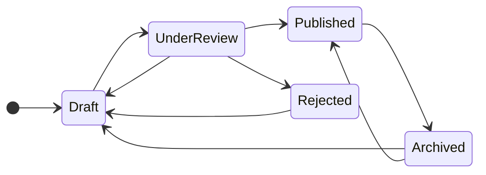

# Etymologie module

:::danger
Deze module is momenteel is beta fase. En er kunnen bugs of afwijkingen in de documentatie aanwezig zijn.
:::

De etymologie-module biedt een gecentraliseerde en gestroomlijnde manier om etymologische gegevens te
verzamelen, te beoordelen en te publiceren binnen het Vlaams Woordenboek. De module ondersteunt zowel
crowdsourcing (gebruikersinzendingen) als redactionele processen.

### Inhoudstafel

[[toc]]

## Doel van de module 

De etymologie module wil het volgende bereiken: 

- Inzicht geven in de hiso-rische herkomst en betekenisontwikkeling van Vlaamse woorden. 
- Gemeenschappelijke inzendingen faciliteren via een gebruiksvriendelijk formulier. 
- Redacteurs de mogelijkheid geven om inzendingen te beheren en te beoordelen.
- De kwaliteit van gepubliceerde informatie waarborgen via een status-gebaseerde workflow.

## Permissies en rollen 

Het toegangsbeheer tot de etymologie-module is gebaseerd op Laravel 's policy classes en gates, en wordt
gefaciliteerd in Laravel Filament via de gebruikersgroepen die gekoppeld zijn aan het account van de gebruiker.
Hieronder vind u een overzicht van de gebruikersgroepen en hun functionaliteiten.

| Gebruikersgroep     | Mogelijkheden                                                                                                                                                        | 
|:--------------------|:---------------------------------------------------------------------------------------------------------------------------------------------------------------------| 
| **`Bezoeker`**      | Raadplegen van alle gepubliceerde etymologieen, en kan suggesties aanleveren gerelateerd aan de etymologie van een woord.                                            | 
| **`Invoerder`**     | Raadplegen van alle gepubliceerde etymologieen, en kan suggesties aanleveren gerelateerd aan de etymologie van een woord.                                            | 
| **`Redacteur`**     | Raadplegen en bewerken van etymologieën in de beheer console. Als ook kan de redacteur deze insturen voor nazicht (controle stap alvorens de publicatie plaatsvind). |
| **`Eindredacteur`** | Raadplegen, bewerken en publiceren van etymologieen in de beheerconsole.                                                                                             | 
| **`Administrator`** | ***Volledig beheer van de module***                                                                                                                                  | 
| **`Ontwikkelaar`**  | ***Volledig beheer van de module***                                                                                                                                  |

## Statussen van de etymologieen 

Elke etymologisch item kent een levenscyclus in de vorm van een status. Deze status bepaalt of en hoe een
inzending zichtbaar is in het systeem.

| Status        | Uitleg                                                                   | 
|:--------------|:-------------------------------------------------------------------------| 
| `draft`       | De inzending is aangemaakt, maar nog niet gepubliceerd/                  | 
| `underReview` | De inzending is gemarkeerd voor beoordeling.                             | 
| `published`   | De inhoud is zichtbaar voor het brede publiek van het woordenboek.       | 
| `archived`    | Niet meer zichtbaar, maar bewaard voor naslag of toekomstig gebruik.     | 
| `rejected`    | De inzending is niet aanvaard, eventueel met motivatie voor de indiener. | 

## Flow state model voor de etymologieen 

De etymologische module maakt gebruik van een flow state model opm het redactionele proces van etymologische gegevens en bijdrages te structureren. 
In plaats van eenvoudige statusvelden of booleans, definieert dit model expliciete toestanden *(states)* die elk een specifieke 
fase in de levenscyclus van een inzending of de gegevens representeren, zoals `draft`, `UnderReview`, `Published`, etc...

### Elke staat bepaalt 

- **Welke acties mogelijk zijn** (bijv. indienen, goedkeuren, publiceren). 
- **Wie die acties mag uitvoeren** (bijv. gebruiker, redacteur, beheerder). 
- **Wat de volgende geldige toestand is**, volgens vooraf vastgestelde transitie-logica.
- 
### Door gebruik van deze flow state kunnen we: 

- De **kwaliteit en consistentie** van etymologische gegevens bewaken.
- Elke bijdrage voorzien van een **duidelijke processtatus.**
- Redacteurs en beheerders voorzien van **controle en transparantie** bij moderatie.

Het systeem ondersteunt controleerbare transities zoals `submit()`, `approveve()`, `reject()`, `publish()`. 
Elke overgang is enkel mogelijk vanuit bepaalde toestanden en onder specifieke toestanden. 

> Dit zorgt voor een duidelijke workflow zonder dat je toestanden hard codeert of per ongeluk ongeldige overgangen begaat.

## Visuele presentatie van het diagram 

### Mogelijke overgangen 

De onderstaande tabel geeft een tekstuele representatie weer van het flow state model:

| Van         | Naar        | Methode         | Toelichting                                 |
|-------------|-------------|-----------------|---------------------------------------------|
| Draft       | UnderReview | submit()        | Indiener dient de etymologie in.            |
| UnderReview | Published   | approve()       | Redacteur keurt en publiceert de inhoud.    |
| UnderReview | Rejected    | reject(reason)  | Redacteur keurt af, vaak met feedback.      |
| UnderReview | Draft       | submit()        | Redacteur stuurt terug voor herwerking.     |
| Rejected    | Draft       | submit()        | Indiener herziet en herstart.               |
| Published   | Archived    | archive(reason) | Redactie archiveert (bijv. verouderd).      |
| Archived    | Draft       | submit()        | Inzending wordt opnieuw bewerkt.            |
| Archived    | Published   | approve()       | Archiefitem wordt opnieuw geldig verklaard. |

## Redactionele richtlijnen 

Redacteurs; Eindredacteurs, administrators, ontwikkelaars volgen de volgende regels voor een consistente en
kwalitatieve aanpak:

- Gebruik enkel gevalideerde bronnen (Van Dale, EWN, Philippa, Middelnederlands Woordenboek, etc).
- Vermijd speculatie zonder taalkundige onderbouwing.
- Schrijf beknopt maar informatief. Vermijd overmatig academisch taalgebruik.
- Noteer taalevolutie in duidelijke stappen: bv. Latijn > Oudfrans > Middelnederlands.
- Indien relevant: vermeld fonetische evolutie, morfologische samenstelling, etc.
