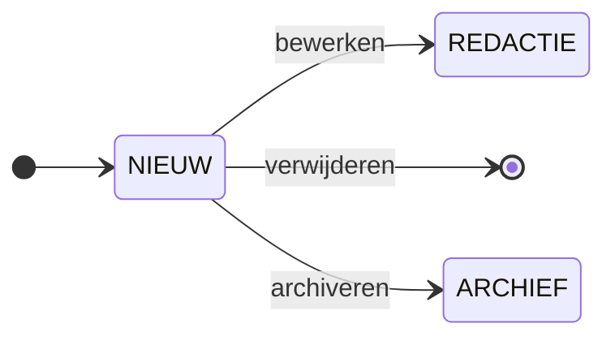
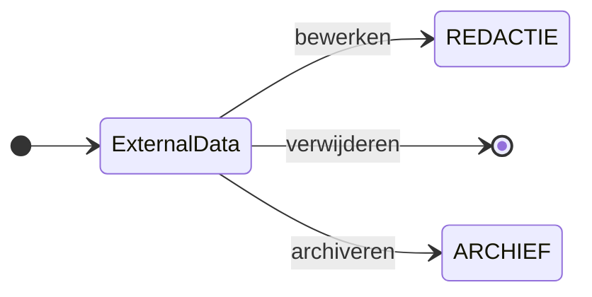
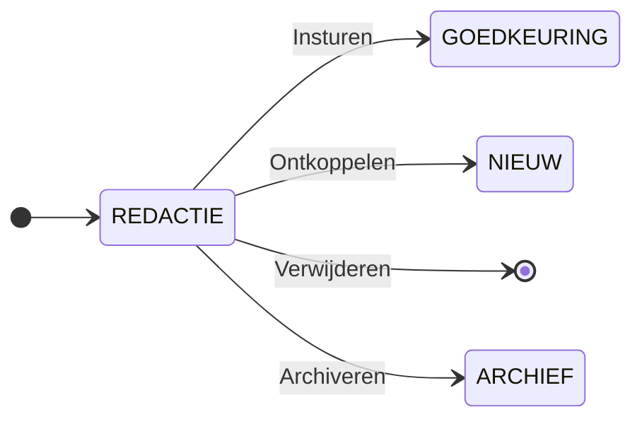
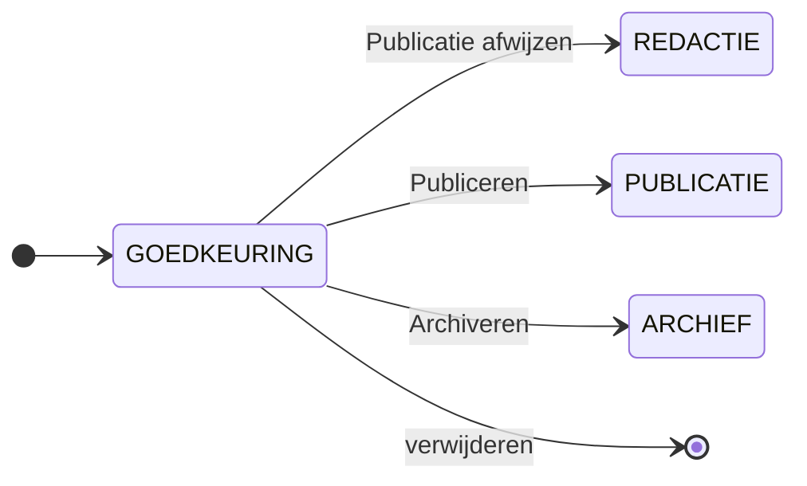
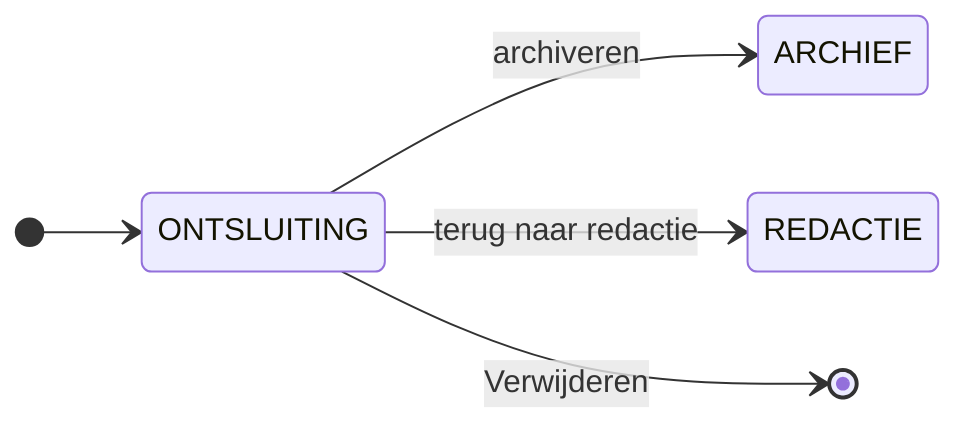
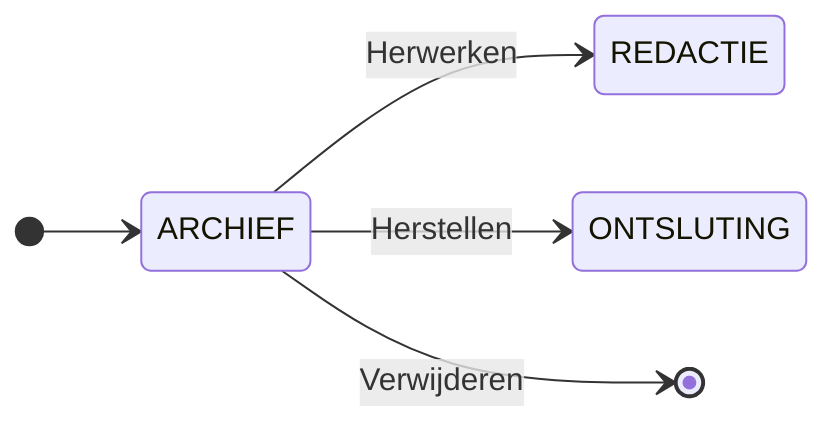

# Levenscyclus van een artikel

Dit document biedt een helder overzicht van de levenscyclus van artikelen binnen het Vlaams Woordenboek.
Het beschrijft de verschillende fasen die een artikel doorloopt, de bijhorende metadata, de rollen van (anonieme) gebruikers, redacteurs en eindredacteurs, en de acties die zij kunnen ondernemen.
Dit stukje in de handleiding is bedoeld om redacteurs en eindredacteurs te ondersteunen bij hun werk: het efficiënt bewerken en beheren van artikelen gedurende het gehele publicatieproces.

Een artikel begint als een suggestie die is aangeleverd door een 'invoerder', een al of niet geregistreerde gastgebruiker. Vervolgens doorloopt die suggestie verschillende fasen van bewerking, goedkeuring en publicatie als artikel.
Tijdens dit proces kunnen redacteurs en eindredacteurs inhoud aanpassen, artikelen eenvormig maken en bepalen of een artikel gepubliceerd, gearchiveerd of verwijderd moet worden.

Hier over volgt een gedetailleerde beschrijving van deze fasen en de mogelijke acties per fase.

:::info
Fasen worden in de hoofding gedocumenteerd met het volgende formaat:

**Schema representatie/Technische representatie**
:::

## Inhoudstafel van het documentatiedocument

[[toc]]

## Nieuw: het begin van een artikel

Wanneer een artikel wordt aangemaakt of als suggestie wordt ingestuurd, start het in de status **nieuw**. Dit betekent dat een gebruiker een suggestie heeft ingestuurd, maar het artikel nog niet publiekelijk beschikbaar is.
Het wacht op bewerking door een redacteur, die kan besluiten om het verder te verfijnen, archiveren, of om te vragen aan een administrator om het te verwijderen indien het niet relevant blijkt
of als ongewenste bijdrage (bv. spam) wordt beschouwd.

In deze fase wordt de status automatisch op **Nieuw** ingesteld, met als oorsprong **suggestie**.
Het artikel staat offline en er is nog geen redacteur of eindredacteur aan het artikel gekoppeld.

Er zijn twee types gebruikers (invoerders): anonieme en geregistreerde.
Anonieme gebruikers kunnen een suggestie doen zonder persoonlijke gegevens achter te laten. Bij publicatie verschijnt hun naam niet onder het nieuwe artikel. Er is geen link tussen anonieme gebruikers en hun suggesties.
Gebruikers kunnen zich, als ze dat wensen, registreren en zo een account aanmaken. Als zij een suggestie indienen, wordt hun account-ID aan die suggesties gekoppeld. Bij de publicatie krijgen die zo erkenning als oorspronkelijke indiener van artikel. In hun account kunnen zij de lijst zien van suggesties die ze ooit hebben ingediend. Zij kunnen ook een persoonlijke lijst van favoriete woorden aanleggen.

### Acties in de fase 'Nieuw'

De volgende acties zijn mogelijk in deze fase. Om het overzicht te behouden geven we het visueel en textueel weer.

- **Bewerken** het artikel gaat naar de redactiefase.
- **Archiveren** het artikel wordt gearchiveerd. Het is mogelijk wel relevant, maar wordt voorlopig niet gepubliceerd.
- **Verwijderen** het artikel is niet verder bewerkt en niet relevant.

### Permissies binnen de fase 'Nieuw'

Het volgende permissieoverzicht is van toepassing op artikeltransities binnen de fase: 

| Actie / Rol                              | Invoerder          | Redacteur          | Eindredacteur      | Administrator      | Ontwikkelaar       | 
| :--------------------------------------- | :----------------: | :----------------: | :----------------: | :----------------: | :----------------: | 
| **Nieuw > Redactie**                     | :white_check_mark: | :white_check_mark: | :white_check_mark: | :white_check_mark: | :white_check_mark: |
| **Nieuw > Archief**                      | :x:                | :x:                | :x:                | :x:                | :x:                |
| **Nieuw > * (verwijderen)***             | :x:                | :x:                | :x:                | :white_check_mark: | :white_check_mark: |

## OUD VW/ExternalData: migratie uit de vorige versie van het Vlaams Woordenboek

Sommige artikelen worden niet nieuw aangemaakt, maar zijn vanuit een ouder systeem overgezet door een ontwikkelaar van het nieuwe Vlaams Woordenboek.
Deze artikelen krijgen automatisch de status `ExternalData`, met de oorsprong als `v1`. In tegenstelling tot suggesties worden die direct online geplaatst en voorzien van een disclaimer die aangeeft dat ze nog niet geredigeerd zijn en dat er dus mogelijk gebreken zijn. Dit zorgt voor transparantie over de kwaliteit van de content.

Een redacteur kan deze artikelen oppikken om ze te bewerken of, indien ze niet langer relevant zijn, direct te archiveren. Een beheerder of een ontwikkelaar kan indien nodig artikelen verwijderen.

- **Bewerken** het artikel wordt naar de redactiefase verplaatst.
- **Archiveren** het artikel wordt gearchiveerd. Het is mogelijk wel relevant, maar wordt voorlopig niet gepubliceerd.
- **Verwijderen** het artikel is niet verder bewerkt en niet relevant.

### Permissies binnen de fase 'Nieuw' 

het volgende permissieoverzicht is van toepassing op artikeltransities binnen de fase: 

:::danger
***fase is nog niet geïntegreerd in deze fase van het artikel***
:::

| Actie / Rol                              | Invoerder          | Redacteur          | Eindredacteur      | Administrator      | Ontwikkelaar       | 
| :--------------------------------------- | :----------------: | :----------------: | :----------------: | :----------------: | :----------------: | 
| **Nieuw > Redactie**                     | | | | |
| **Nieuw > Archief**                      | | | | |
| **Nieuw > * (verwijderen)***             | | | | |

## Redactie/Draft: de inhoudelijke bewerking

Een redacteur pikt een artikel uit een van de vorige fasen (nieuw of external data) op en begint met de inhoudelijke en taalkundige bewerking en correctie. Dit is een cruciale stap waarbij de kwaliteit van de content wordt gewaarborgd.
Tijdens deze fase kan het artikel al online staan, zoals wanneer er meldingen die bij een artikel zijn binnengekomen worden opgelost.

De redacteur die het artikel claimt, wordt geregistreerd als verantwoordelijke.
Zodra het artikel voldoende bewerkt is, kan het naar de eindredacteur worden doorgestuurd ter goedkeuring.
Indien nodig kan het ook losgekoppeld worden van de redacteur en verwijderd worden uit de databank of direct worden gearchiveerd.

### Acties in deze fase

De volgende acties zijn mogelijk in deze fase. Om het overzicht te behouden geven we het visueel en textueel weer.

- **Insturen** zodra de redacteur klaar is met bewerken kan hij/zij het insturen voor publicatie.
- **Archiveren** als het artikel mogelijk wel relevant is, maar het (voorlopig) toch niet gepubliceerd wordt.
- **Ontkoppelen** indien de redacteur het artikel op zich heeft genomen maar het werk toch te complex blijkt, of de redacteur heeft geen ruimte meer om het te behandelen, dan kan hij of zij als redacteur ontkoppeld worden. Het artikel komt weer vrij en kan door een andere redacteur worden opgepikt.
- **Verwijderen**, kan alleen door de administrator of ontwikkelaar.

#### Acties binnen dezelfde fase van het artikel

De volgende acties kunnen worden uitgevoerd binnen de artikelfase. Omdat de fase niet wijzigt nadat de actie is uitgevoerd, zijn deze niet opgenomen binnen de visuele representatie.

- **Bewerken** het artikel blijft in de huidige status.

### Permissies binnen de redactionele fase 

Het volgende permissieoverzicht is van kracht op artikeltransities binnen de redactionele fase: 

| Actie / Rol                              | Invoerder | Redacteur                       | Eindredacteur                   | Administrator                   |  Ontwikkelaar                   | 
| :--------------------------------------- | :-------: | :-----------------------------: | :-----------------------------: | :-----------------------------: | :-----------------------------: | 
| **Redactie > Redactie *(bewerken)***     | :x:       | :white_check_mark: (toegewezen) | :white_check_mark: (toegewezen) | :white_check_mark: (toegewezen) | :white_check_mark: (toegewezen) |  
| **Redactie > Nieuw**                     | :x:       | :white_check_mark: (toegewezen) | :white_check_mark: (toegewezen) | :white_check_mark:              | :white_check_mark:              |
| **Redactie > Archief**                   | :x:       | :x:                             | :x:                             | :x:                             | :x:                             |
| **Redactie > Verwijderen**               | :x:       | :x:                             | :x:                             | :white_check_mark:              | :white_check_mark:              |      

## Goedkeuring/Approval: De laatste controle 

Wanneer een redacteur tevreden is met de bewerking, wordt het artikel ter goedkeuring aangeboden aan een eindredacteur. 
Die beoordeelt de inhoud en redactionele kwaliteit en beslist of het artikel klaar is voor publicatie. De eindredacteur kan het artikel goedkeuren en publiceren of terugsturen voor verdere redactie. 

De eindredactezur krijgt in deze fase de verantwoordelijkheid over het artikel.
Er is een duidelijke scheiding tussen redacteur en eindredacteur. Een eindredacteur die zelf een artikel heeft bewerkt, kan zijn eigen artikelen niet goedkeuren of afwijzen. 
Deze werkwijze garandeert een objectieve kwaliteitscontrole. 

### Acties in de Goedkeuring/Approval fase 

De volgende acties kunnen worden uitgevoerd binnen de artikelfase. Omdat de fase niet wijzigt na het uitvoeren van de acties zijn die niet opgenomen binnen de visuele representatie.

- **Publiceren** het artikel voldoet aan de kwaliteitsnormen. 
- **Publicatie afwijzen** er zijn nog aanpassingen nodig. 
- **Archiveren** de publicatie is nog niet gewenst, maar het artikel wordt toch bijgehouden om  verschillende redenen.
- **Verwijderen**, kan alleen door de administrator of ontwikkelaar.

### Permissies binnen de goedkeuringsfase 

Het volgende permissieoverzicht is van kracht op artikeltransities binnen de goedkeuringsfase. 

| Actie / Rol                              | Invoerder | Redacteur          | Eindredacteur      | Administrator      | Ontwikkelaar       | 
| :--------------------------------------- | :-------: | :----------------: | :----------------: | :----------------: | :----------------: | 
| **Goedkeuring > Redactie**               | :x:       | :x:                | :white_check_mark: | :white_check_mark: | :white_check_mark: |
| **Goedkeuring > Publicatie**             | :x:       | :x:                | :white_check_mark: | :white_check_mark: | :white_check_mark: |
| **Goedkeuring > Archief**                | :x:       | :x:                | :white_check_mark: | :white_check_mark: | :x:                |
| **Goedkeuring > Verwijderen**            | :x:       | :x:                | :x:                | :x:                | :x:                |

## Ontsluiting/Published: Publicatie 

Zodra een artikel is goedgekeurd, wordt het gepubliceerd en is het toegankelijk voor eindgebruikers. Hhet redactionele proces is afgerond. 
De metadata blijven grotendeels ongewijzigd, behalve dat de publicatiestatus op **Online** wordt gezet. Bovendien worden de tijd en het id van de eindredacteur genoteerd voor administratieve doeleinden. 

Ook in deze fase kan het artikel indien nodig naar redactie worden teruggestuurd of naar het archief verplaatst, bijvoorbeeld wanneer het niet meer relevant is of verouderd raakt. 

### Acties in de Ontsluiting/Published fase

- **Terug naar redactie** het artikel heeft een grondig onderhoud door de redactie nodig en moet terug ter controle worden aangeboden. 
- **Archiveren** het artikel is niet meer relevant in zijn huidige context
- **Verwijderen**, kan alleen door een administrator of ontwikkelaar. 

#### Acties binnen dezelfde fase van het artikel

- **Bewerken** het artikel kan door eindredacteurs worden aangepast, bijvoorbeeld bij het verwerken van gebruikersmeldingen. 

### Permissies in de onsluitingsfase

Het volgende permissieoverzicht is van kracht op artikeltransities binnen de publicatiestatus:

| Actie / Rol                              | Invoerder | Redacteur          | Eindredacteur      | Administrator      | Ontwikkelaar       | 
| :--------------------------------------- | :-------: | :----------------: | :----------------: | :----------------: | :----------------: | 
| **Publicatie > Publicatie *(bewerken)*** | :x:       | :x:                | :x:                | :x:                | :x:                |
| **Publicatie > Archief**                 | :x:       | :x:                | :white_check_mark: | :white_check_mark: | :x:                |
| **Publicatie > Verwijderen**             | :x:       | :x:                | :x:                | :white_check_mark: | :white_check_mark: |

## Archief/Archived: artikel is niet langer meer actief 

Wanneer een artikel niet meer relevant is, wordt het gearchiveerd en verdwijnt het uit de publiek toegankelijke omgeving. 
Dit betekent niet dat het definitief verwijderd is. Indien nodig kan het artikel nog worden hersteld. 

In deze fase blijven de metadata ongewijzigd; alleen de publicatiestatus wordt op `offline` gezet.
De eindredacteur en administrator kunnen bepalen of het artikel in het archief blijft, hersteld wordt of definitief verwijderd wordt. 

### Acties in de archiefstatus: 

- **Herstellen** het artikel is ten onrechte gearchiveerd. 
- **Herwerken** het artikel is gearchiveerd, maar kan weer gepubliceerd worden nadat het een update heeft gekregen. 
- **Verwijderen** het artikel moet volledig uit het systeem verdwijnen.

### Permissies in de archiefstatus: 

Het volgende permissieoverzicht is van kracht op artikeltransitites binnen de archiefstatus: 

| Actie / Rol                        | Invoerder | Redacteur          | Eindredacteur      | Administrator      | Ontwikkelaar       | 
| :--------------------------------- | :-------: | :----------------: | :----------------: | :----------------: | :----------------: | 
| **Archief > Archief *(bewerken)*** | :x:       | :white_check_mark: | :white_check_mark: | :white_check_mark: | :white_check_mark: |
| **Archief > Redactie**             | :x:       | :white_check_mark: | :white_check_mark: | :white_check_mark: | :white_check_mark: |
| **Archief > Verwijderen**          | :x:       | :x:                | :x:                | :white_check_mark: | :white_check_mark: |
