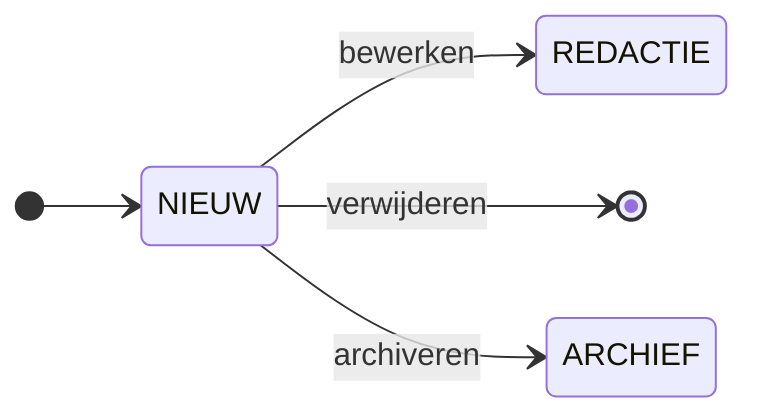
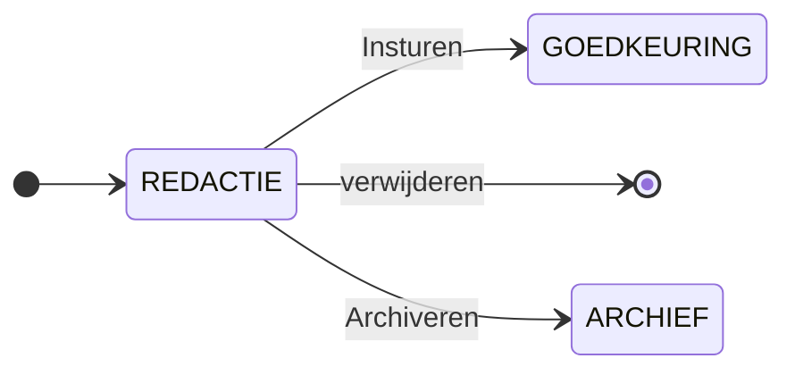
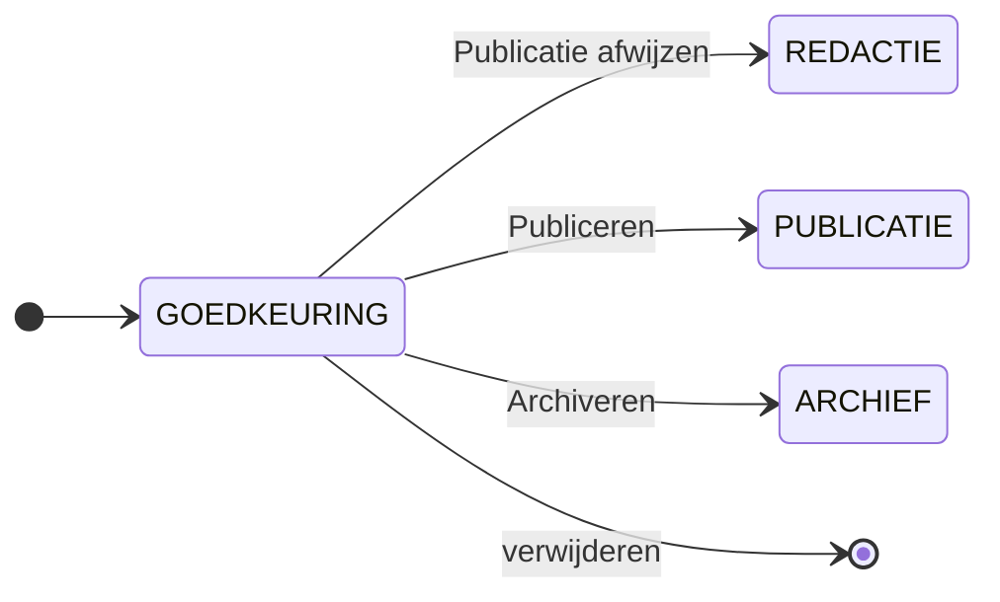
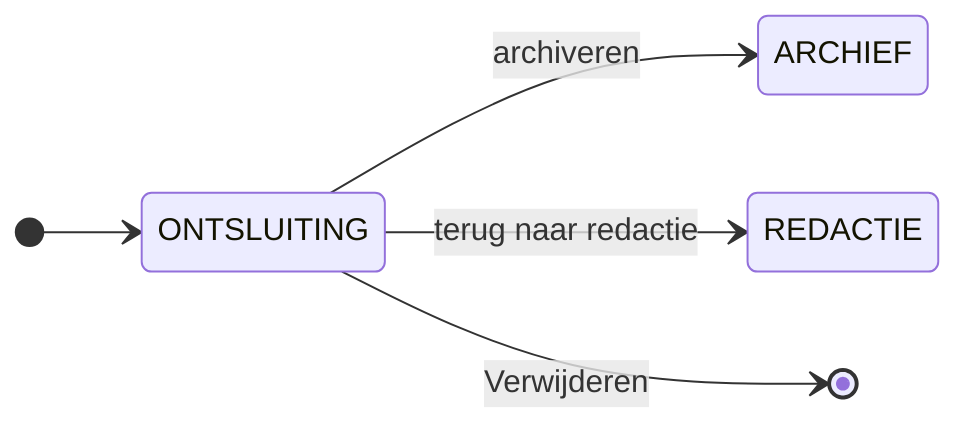
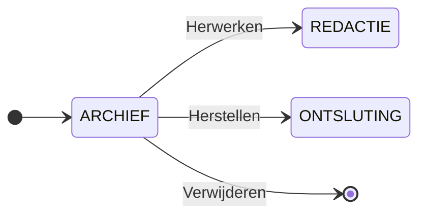

# Artikel levenscyclus en werkstroom

Dit document biedt een helder overzicht van de levenscyclus van artikelen binnen het nieuw VW-systeem.
Het beschrijft de verschillende fasen die een artikel doorloopt, de bijhorende metadata, de rollen van (anonieme) gebruikers, redacteuren en eindredacteuren, en de acties die zij kunnen ondernamen.
Dit stukje in de handleiding is bedoeld om redacteuren en eindredacteurs te ondersteunen bij het efficient beheren van artikelen gedurende het gehele publicatieproces.

Een artikel begint als een suggestie dat is aangeleverd door een gastgebruiker en doorloopt vervolgens verschillende fasen van bewerking, goedkeuring en publicatie.
Tijdens dit proces kunnen redacteurs en eindredactezurs inhoud aanpassen, kwaliteit bewaken en bepalen of een artikel gebuplieerd, gearchiveerd of verwijderd moet worden.

Hier over volgt een gedetailleerde beschrijving van deze fasen en de mogelijke acties per fase.

:::info
Fasen worden in de hoofding gedocumenteerd met het volgende formaat:

**Schema representatie/Technische representatie**
:::

## Nieuw/New: het begin van een artikel

Wanneer een artikel wordt aangemaakt of als suggestie word ingestuurd, start het in de status **nieuw**. Dit betekend dat een gebruiker een suggestie heeft gedaan maar het artikel nog niet publiekelijk beschikbaar is.
Het wacht op bewerking door een redacteur, die kan besluiten om het verder te verfijnen, archiveren, of om te vragen aan een administrator om het te verwijderen indien het niet relevant blijkt.
Of als ongewenst bijdrage (bv. spam) word geintrepreteerd/ervaren.

In deze fase wordt de status automatisch op **Nieuw** ingesteld, met de oorsprong als **suggestie**.
Het artikel blijft offline en er is nog geen reacteur of eindredacteur aan het artikel gekoppeld.

Indien de gebruiker die de suggestie doet aangemeld is met zijn account zal zijn account ID gekoppeld worden aan de suggestie, en later bij publicatie de nodige herkenning krijgen bij het artikel,
terwijl een anonieme gebruiker alleen de suggestie doet zonder enige vorm van persoonlijke gegevens achter te laten wegens bv. privacy redenen. hij/zij zal dan ook geen herkenning krijgen voor de suggestie.

### Acties in de Nieuw fase

De volgende acties zijn mogelijk in deze fase. Om het overzicht te behouden geven we het visueel en textueel weer.

- **Bewerken** om het artikel naar de redactiefase te verplaatsen.
- **Archiveren** om het artikel te archiveren aangezien er wel een relevantie is maar toch het besluit word genomen om het niet te publiceren.
- **Verwijderen**, mits er nog geen verdere bewerking heeft plaatsgevonden.

## OUD VW/New: migratie uit de vorige versie van het Vlaams Woordenboek

Sommige artikelen worden niet nieuw aangemaakt, maar overgezet vanuit een ouder systeem door een ontwikkelaar van het nieuwe Vlaams Woordenboek.
Deze artikelen krijgen automatisch de status `Nieuw`, met de oorsprong als `OUD VW` in tegenstelling tot de suggesties worden deze direct online geplaatst,
maar voorzien van een disclaimer die aangeeft dat ze nog niet geregideerd zijn. Dit waarborgt de transparantie over de kwaliteit van de content.

Hierbij wordt de oorsprong ingesteld op 'suggestie', en de melding bevat een disclaimer over de mogelijke gebreken in de inhoud.
Een redacteur kan deze artikelen oppakken om ze te bewerken of, indien ze niet langer relevant zijn, direct archiveren. Terwijl een administrator of een ontwikkelaar artikelen kan verwijderen indien nodig.

- **Bewerken** om het artikel naar de redactiefase te verplaatsen.
- **Archiveren** om het artikel te archiveren aangezien er wel een relevantie is maar toch het besluit word genomen om het niet te publiceren.
- **Verwijderen**, mits er nog geen verdere bewerking heeft plaatsgevonden.

## Redactie/Draft: de inhoudelijke bewerking

Een redacteur neemt een artikel uit de vorige fasen op zich en begint met de inhoudelijke en taalkundige verbetering. Dit is een cruciale stap waarin de kwaliteit van de content wordt gewaarborgd.
Tijdens deze fase kan het artikel al online zijn, denk bv aan het oplossen van meldingen die gebeurd zijn voor het artikel.

De redacteur die het artikel claimt, wordt geregistreerd als verantwoordelijke.
Zodra het artikel voldoende bewerkt is, kan het worden doorgestuurd naar de eindredacteur ter goedkeuring.
Indien nodig kan het echter ook de redacteur ontkoppeld worden van het artikel en verwijderd worden uit de databank of direct worden gearchiveerd.

### Acties in deze fase

De volgende acties zijn mogelijk in deze fase. Om het overzicht te behouden geven we het visueel en textueel weer.

- **Insturen** indien de reacteur klaar is met de nodige bewerkingen kan hij/zij deze insturen voor publicatie.
- **Archiveren** om het artikel te archiveren aangezien er wel een relevantie is maar toch het besluit word genomen om het niet te publiceren.
- **Verwijderen**, mits de gebruiker de rol heeft van administrator of ontwikkelaar.

#### Acties binnen de zelfde fase van het artikel

De volgende acties kunnen worden uitgevoerd binnen de artikel fase. Omdat deze geen fase wijziging krijgen na het uitvoeren van de actie zijn deze niet opgenomen binnen de visuele representatie.

- **Bewerken** het artikel behoud zijn status maar blijft in de huidige status.
- **Ontkoppelen** indien de redacteur het artikel opzich heeft genomen maar het werk is te complex of heeft geen ruimte meer heeft om het te behandelen kan hij/zij ontkoppeld worden als redacteur

## Goedkeuring/Approval: De laatste controle 

Wanneer een redacteur tevreden is met de bewerking, kan het artikel ter goedkeuring worden aangeboden aan een eindredacteur. 
Deze beoordeelt de inhoud en redactionele kwaliteit en beslist of het artikel klaar is voor publicatie. De eindredacteur kan het artikel goedkeuren en publiceren of terugsturen voor verdere redactie. 

De eindredactezur krijgt in deze fase de verantwoordelijkheid over het artikel.
Er is een duidelijke scheiding tussen redacteur en eindredacteur naast het feit dat een eindredacteur die ook het artikel heeft bewerkt zijn eigen artikelen niet kan goedkeuren of afwijzen. 
Dit is geimplementeerd om een objectieve kwaliteitscontrole te garanderen. 

### Acties in de Goedkeuring/Approval fase 

De volgende acties kunnen worden uitgevoerd binnen de artikel fase. Omdat deze geen fase wijziging krijgen na het uitvoeren van de actie zijn deze niet opgenomen binnen de visuele representatie.

- **Publiceren** als het artikel vordoet aan de kwaliteitsnormen. 
- **Publicatie afwijzen** als er nog verdere aanpassing nodig zijn. 
- **Archiveren** als publicatie niet wenselijk is maar toch word bijgehouden omtrent verschillende redenen.
- **Verwijderen**, mites de gebruiker de rol heeft van administrator of ontwikkelaar.

## Ontsluiting/Published: Publicatie 

Zodra een artikel is goedgekeurd, wordt het gepubliceerd en toegankelijk gemaakt voor eindgebruikers. Dit markeert de afronding van het redactionele proces. 
De metadata blijven grotendeels ongewijzigd, behalve dat de publicatie status op **Online** word gezet. als ook de tijdnotering en id van de eindredacteur worden genoteerd voor administratieve redenen. 

Ook in deze fase blijft de optie bestaan om het artikel terug te sturen naar redactie of naar het archief te verplaatsen, bijvoorbeeld wanneer het niet meer relevant of verouderd raakt. 

### Acties in de Ontlsuiting/Published fase

- **Terug naar redactie** indien het artikel een gronding onderhoud door de redactie vereist en terug aangeboden moet worden ter controle. 
- **Archiveren** indien het artikel niet meer relevant is in zijn huidige context
- **Verwijderen**, mits de gebruiker de ùachtiging heeft van een administrator of ontwikkelaar. 

#### Acties binnen de zelfde fase van het artikel

- **Bewerken** het artikel kan worden aangepast door eindredacteurs bijvoorbeeld bij het verwerken van gebruikers meldingen. 

## Archief/Archived: artikel is niet langer meer actief 

Wanneer een artikel zijn relevantie verliest, wordt het gearchiveerd en verdwijnt het uit de publieke omgeving. 
Dit betekent niet dat het definitief verwijderd is, indien nodig kan het artikel nog worden hersteld. 

In deze fase blijft de metadata ongewijzigd, behalve dat de publicatiestatus op `offline` word gezet.
De eindredacteur en administrator kunnen bepalen of het artikel in het archief blijft, hersteld word of definitief verwijderd wordt. 

### Acties in de archief status: 

- **Herstellen** indien het artikel ten onrechte gearchiveerd is. 
- **Herwerken** indien het artikel gearchiveerd is maar terug willen publiceren nadat het een update heeft gekregen. 
- **Verwijderen** indien het volledig uit het systeem moet verdwijnen.